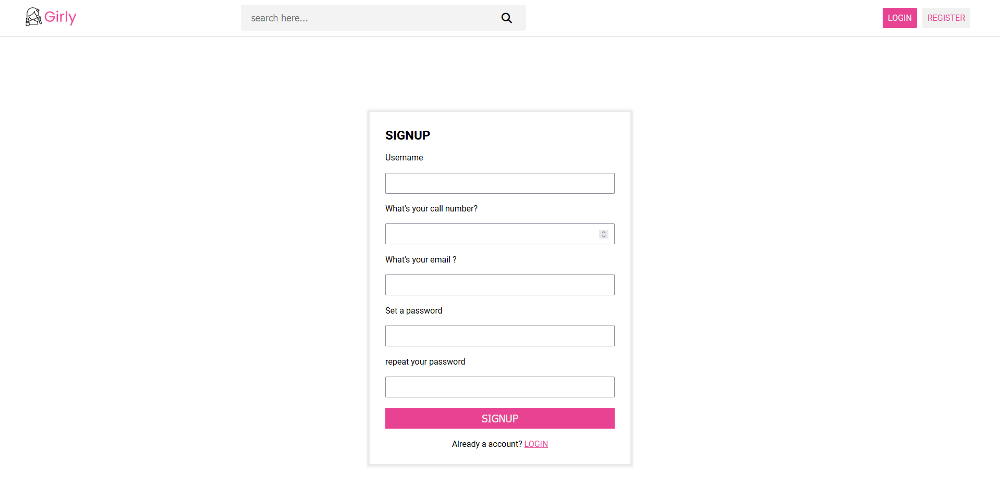
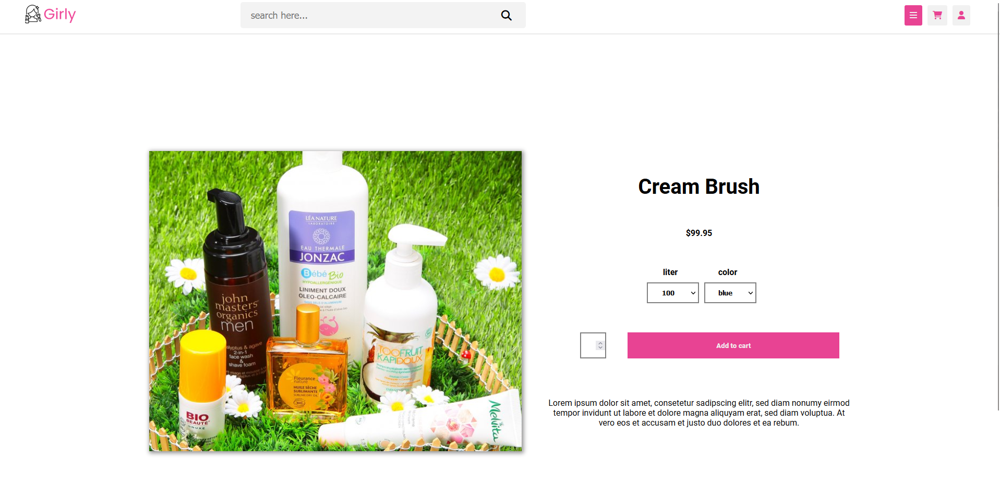

# GIRLY STORE 
## Documentation

### Start the app

- First start the Express Api 


```js
npm install  // install the dependencies and node_modules
````


```js
npm run start  //  start the server
````

- Afterwards start the react App

```js
npm install  // install the dependencies and node_modules
````

```js
npm start  // start the react app
````


### Screens of the App





 
